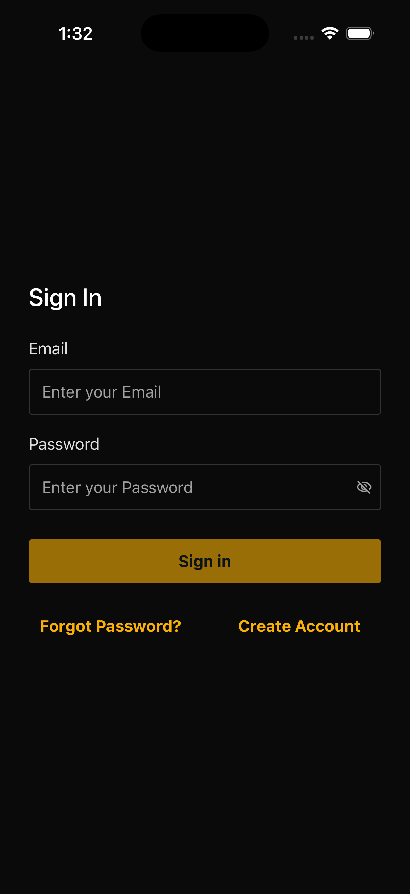
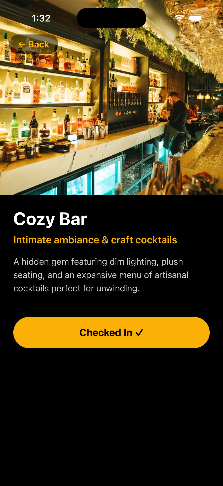

# Venue Check-In App

This is a standalone React Native screen that simulates a core user flow: authenticating a user and executing a venue check-in. It uses AWS Cognito for authentication and Amazon DynamoDB (via AWS Amplify Gen 2) for tracking check-in events.

## Features
- **Authentication**: Sign up, sign in, and sign out using AWS Cognito (Email/Password). Session persistence handles keeping the user logged in across app restarts.
- **Venue Check-in**: Authenticated users can view a mock venue and check in.
- **State Management**: Robust handling of loading states, network errors, auth failures.
- **Check-in Validation**: Prevents duplicate check-ins to the same venue by automatically enforcing unique combinations in the data model.
- **Code Quality**: Clean component structure, custom hooks for business logic separation, and no inline style dumps. Structure acts as a modular piece of a larger scalable application.

## Tech Stack
- **Framework**: React Native (Expo)
- **Backend/Auth**: AWS Amplify Gen 2, AWS Cognito, Amazon DynamoDB
- **UI/Styling**: Responsive components using React Native `StyleSheet`

## Screenshots

<p align="center">
  
  
  
</p>

## Setup Instructions

### Prerequisites
- Node.js (v18+)
- npm or yarn
- An AWS account (Free Tier is sufficient)
- Expo CLI

### 1. Clone the repository
```bash
git clone <repository_url>
cd upwork-the-mix-technical-assessment
```

### 2. Install dependencies
```bash
npm install
```

### 3. AWS Amplify Backend Setup
This project uses AWS Amplify Gen 2. You will need to deploy the backend resources to your personal AWS account.

1. Configure your AWS credentials locally (e.g. `aws configure`) or authenticate via AWS CLI.
2. Deploy the sandbox backend environment:
   ```bash
   npx ampx sandbox
   ```
   This will synthesize the CDK stack, deploy the Cognito User Pool and the DynamoDB tables to your AWS account. It will also dynamically generate the `amplify_outputs.json` file in the project root, keeping the client connected to your backend. Keep this running in a separate terminal.

### 4. Run the app
Start the Expo development server:
```bash
npm start
```
Use the Expo Go app on your phone, or run it on an iOS Simulator / Android Emulator.

For iOS Simulator:
```bash
npm run ios
```
For Android Emulator:
```bash
npm run android
```

## Assumptions
- **Venue Data**: Venue data is assumed to be hardcoded on the client-side as per the specifications. In a real-world scenario, this would be fetched dynamically from a backend service using a GraphQL/REST API.
- **Check-ins**: A user can only check into a given venue once. The DynamoDB model sets `.identifier(['userId', 'venueId'])`, making the combination of user and venue the primary key. 
- **Auth**: Only Email/Password authentication is required. Complex multi-factor authentication (MFA) and social logins are omitted for simplicity and scope.
- **Routing**: Expo Router is used to handle transitions gracefully between the Auth screens and the Home screen. Unauthenticated users are protected and redirected to the login screen.

## What I'd Improve Given More Time
1. **Global State Management**: While local state and React context are adequate for the current scope, I would integrate Redux Toolkit or Zustand for managing heavier global state (like deeply nested settings, caching complex payloads) as the application grows.
2. **Offline Support**: I would implement an offline-first architecture. If a user tries to check in without an internet connection, the event would be queued in local storage (`AsyncStorage` or WatermelonDB) and synchronized with DynamoDB once the connection is restored.
3. **Animations and Micro-interactions**: I would leverage `react-native-reanimated` to introduce polished micro-interactions (e.g., skeleton loaders, a smooth, lively transition after a successful check-in, pulsing buttons) to enhance the feeling of a premium user experience.
4. **Testing Architecture**: Introduce `Jest` alongside React Native Testing Library for robust unit testing of components and hooks, and set up `Detox` for end-to-end integration testing of the complete check-in and auth flows.
5. **Real Venue Discovery**: Integrate a real location-based API (like Google Places or Foursquare) and leverage the device's native `expo-location` APIs to calculate real distances, allowing users to discover and check into venues effectively around them.
6. **Continuous Integration (CI/CD)**: Set up a GitHub Actions workflow combined with EAS Build (Expo Application Services) to run code analysis on PRs automatically and seamlessly distribute test builds to devices.
